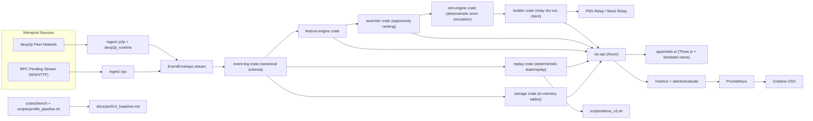
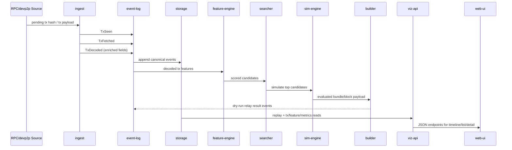

# V2 Architecture Diagram

This diagram captures the end-to-end MEV research pipeline implemented in this repository.

```mermaid
flowchart LR
    subgraph Sources["Mempool Sources"]
        RPC["RPC Pending Stream (WS/HTTP)"]
        P2P["devp2p Peer Network"]
    end

    RPC --> IRPC["ingest::rpc"]
    P2P --> IP2P["ingest::p2p + devp2p_runtime"]

    IRPC --> BUS["EventEnvelope stream"]
    IP2P --> BUS

    BUS --> ELOG["event-log crate (canonical schema)"]

    ELOG --> STORAGE["storage crate (in-memory tables)"]
    ELOG --> REPLAY["replay crate (deterministic state/replay)"]
    ELOG --> FEAT["feature-engine crate"]

    FEAT --> SEARCH["searcher crate (opportunity ranking)"]
    SEARCH --> SIM["sim-engine crate (deterministic revm simulation)"]
    SIM --> BUILDER["builder crate (relay dry-run client)"]
    BUILDER --> RELAY["PBS Relay / Mock Relay"]

    STORAGE --> API["viz-api (Axum)"]
    REPLAY --> API
    FEAT --> API
    SEARCH --> API
    BUILDER --> API

    API --> UI["apps/web-ui (Three.js + list/detail views)"]
    API --> METRICS["/metrics + /alerts/evaluate"]
    METRICS --> PROM["Prometheus"]
    PROM --> GRAF["Grafana OSS"]

    REPLAY --> DEMO["scripts/demo_v2.sh"]
    BENCH["crates/bench + scripts/profile_pipeline.sh"] --> PERF["docs/perf/v2_baseline.md"]
```

## Transaction Lifecycle (Data Plane)

```mermaid
sequenceDiagram
    participant Src as RPC/devp2p Source
    participant Ingest as ingest
    participant Log as event-log
    participant Store as storage
    participant Feat as feature-engine
    participant Search as searcher
    participant Sim as sim-engine
    participant Build as builder
    participant API as viz-api
    participant UI as web-ui

    Src->>Ingest: pending tx hash / tx payload
    Ingest->>Log: TxSeen
    Ingest->>Log: TxFetched
    Ingest->>Log: TxDecoded (enriched fields)
    Log->>Store: append canonical events
    Log->>Feat: decoded tx features
    Feat->>Search: scored candidates
    Search->>Sim: simulate top candidates
    Sim->>Build: evaluated bundle/block payload
    Build-->>Log: dry-run relay result events
    Store->>API: replay + tx/feature/metrics reads
    API->>UI: JSON endpoints for timeline/list/detail
```
